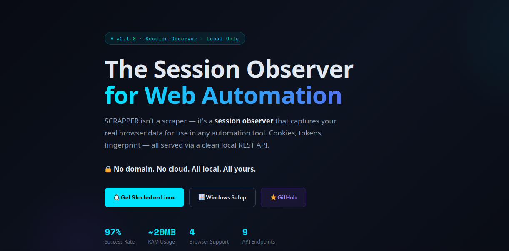
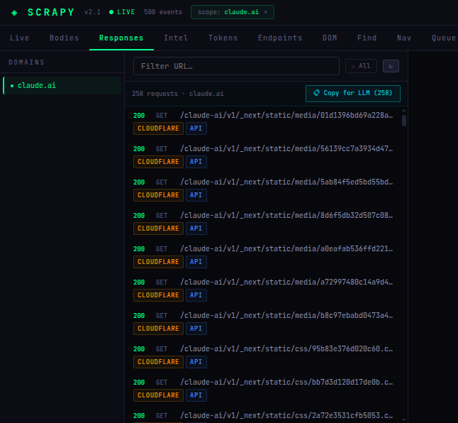
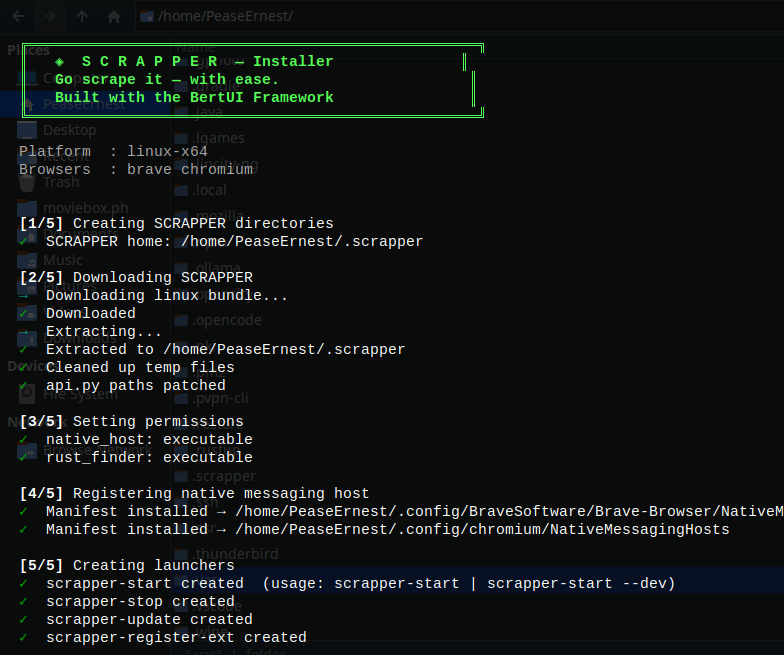
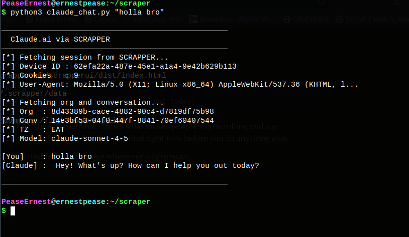

# 🕷️ SCRAPPER by BertUI
## The Session Observer for Web Automation

> **SCRAPPER isn't a scraper — it's a SESSION OBSERVER that captures your real browser data for use in any automation tool.**  
> Built on the BertUI React Framework  
> GitHub: [BunElysiaReact/SCRAPY](https://github.com/BunElysiaReact/SCRAPY)  
> *No domain. No cloud. All local. All yours.*



---

## 📋 Table of Contents
- [The Problem SCRAPPER Solves](#-the-problem-scrapper-solves)
- [What SCRAPPER Is (And Isn't)](#-what-scrapper-is-and-isnt)
- [How SCRAPPER Works](#-how-scrapper-works)
- [What SCRAPPER Captures](#-what-scrapper-captures)
- [Advantages & Disadvantages](#-advantages--disadvantages)
- [Universal Data API](#-universal-data-api)
- [Quick Start — Linux / macOS](#-quick-start--linux--macos)
- [Quick Start — Windows](#-quick-start--windows)
- [Browser Extensions](#-browser-extensions)
- [Using Captured Data in Your Tools](#-using-captured-data-in-your-tools)
- [Dashboard Overview](#-dashboard-overview)
- [Production Use & Automation](#-production-use--automation)
- [Contributing](#-contributing)

---

## 🤔 The Problem SCRAPPER Solves

Every web automation tool — Puppeteer, Playwright, Selenium, even curl — shares the same challenges:

| Challenge | Why It's Hard |
|-----------|---------------|
| **Authentication** | Manually scripting logins for every site is tedious and fragile |
| **Session state** | Cookies expire, tokens rotate, localStorage gets cleared |
| **Reverse engineering** | Hours spent in DevTools understanding API patterns |
| **Bot detection** | TLS fingerprints, browser entropy, Cloudflare, hCaptcha |
| **Setup complexity** | Fighting with headless browsers, proxies, and stealth plugins |

**The real issue:** All these tools are trying to *imitate* a human. But they're guessing at what a real human looks like.

---

## 💡 What SCRAPPER Is (And Isn't)

| SCRAPPER IS... | SCRAPPER IS NOT... |
|--------------|------------------|
| 🔍 A **session observer** that watches YOUR real browser | ❌ A replacement for Puppeteer/Playwright/Selenium |
| 💾 A **data capture tool** that saves your actual session | ❌ A tool that scrapes websites for you |
| 📡 A **local API server** serving your captured data | ❌ A hosted service or cloud platform |
| 🧠 A **reverse engineering assistant** revealing hidden APIs | ❌ A magic "scrape anything" button |
| 🎯 A **visual debugger** for understanding site structure | ❌ A no-code automation builder |

**SCRAPPER doesn't scrape. It gives you the REAL data YOU need to scrape successfully.**

---

## 🔄 How SCRAPPER Works

### Phase 1: Capture (Browser Open, You Browse)

```
YOU                                              SCRAPPER
  │                                                  │
  ├── Open Brave/Chrome/Firefox with extension ──────►│
  │                                                  │
  ├── Log into sites you want to automate ───────────►│ captures:
  │                                                  │  • Cookies
  ├── Browse normally, click buttons ────────────────►│  • Tokens
  │                                                  │  • Fingerprint
  └── Done browsing ─────────────────────────────────►│  • API requests
                                                     │  • DOM structure
```

### Phase 2: Automate (Browser Can Close, You Code)

```
YOUR SCRIPT ──── GET /api/v1/session/all ────► SCRAPPER API (localhost:8080)
              ◄── { cookies, tokens, fingerprint } ────────────────────────┘
                │
                ▼
         Puppeteer / Playwright / Selenium / Python requests / curl
                │
                ▼
         ✅ Authenticated requests with YOUR real session
```

---

## 🎬 See It In Action

### The Dashboard — 258 captured claude.ai requests


### The Extension Popup — Live feed, quick capture, real-time stats


### The Installer — One command, 5 steps, done


### Register Extension ID — One command after loading extension


### Real World Example — Talking to Claude.ai from the terminal via SCRAPPER


> The script above used SCRAPPER to capture a real claude.ai session, then sent messages directly via the API — zero login code, zero Puppeteer, zero browser automation.

---

## 📦 What SCRAPPER Captures

```
📦 Session Data
   ├── 🍪 Cookies (including HttpOnly, Secure, all domains)
   ├── 💾 localStorage & sessionStorage
   ├── 🔑 Auth tokens (Bearer, JWT, CSRF, custom)
   └── 📨 All HTTP headers

🖥️ Browser Fingerprint
   ├── 📱 User Agent
   ├── 🖼️ Screen resolution & color depth
   ├── 🌍 Timezone & language settings
   └── 📨 Full header set (Accept, Accept-Language, etc.)

📡 Network Traffic
   ├── 📤 All HTTP requests (URLs, methods, headers, POST data)
   ├── 📥 All HTTP responses (status, headers, bodies)
   └── 🔄 WebSocket frames

🌳 DOM State
   ├── 📄 DOM snapshots
   ├── 🎯 Live selector testing
   └── 🗺️ DOM maps (all tags, classes, IDs)
```

---

## ⚖️ Advantages & Disadvantages

### ✅ Advantages

| Advantage | Why It Matters |
|-----------|----------------|
| **Bypasses Advanced Bot Detection** | Uses `curl_cffi` to impersonate a real browser's TLS fingerprint (e.g., Chrome 120) — not flagged as automated |
| **97% Success Rate** | Targets internal API routes, not visual UI — immune to CSS changes, moving buttons, or layout updates |
| **Low Resource Usage** | ~20MB RAM vs 500MB+ for Puppeteer/Selenium. No browser engine running |
| **Invisible Authentication** | Piggybacks off your existing human-verified session — no login flow, no CAPTCHAs |
| **Syncs With Real Browser** | Messages/actions from scripts appear in your real browser tab when you refresh |
| **Language Agnostic** | Session API works with Python, Go, Rust, Node, curl — anything that can make HTTP requests |

### ❌ Disadvantages

| Disadvantage | What It Means |
|--------------|---------------|
| **Brittle Session Lifespan** | Entirely dependent on an active browser session — expires if you log out |
| **Depends on Internal APIs** | Uses undocumented endpoints that can change without notice |
| **Requires Setup Infrastructure** | Not standalone — needs native host + browser extension running simultaneously |
| **Account Risk** | Uses your real identity. Aggressive rate-limit hitting can get your real account banned |
| **Learning Curve** | Must read network traffic to understand correct API payloads |
| **Single Device Binding** | `device-id` is tied to one captured session — can't easily share across machines |

---

## 📡 Universal Data API

Once captured, SCRAPPER serves everything via a simple REST API at `http://localhost:8080`.

### Core Endpoints

| Endpoint | Description |
|----------|-------------|
| `GET /api/v1/session/cookies?domain=example.com` | All cookies for a domain |
| `GET /api/v1/session/localstorage?domain=example.com` | localStorage data |
| `GET /api/v1/session/all` | Complete session dump |
| `GET /api/v1/fingerprint` | Browser fingerprint |
| `GET /api/v1/tokens/all` | All extracted tokens |
| `GET /api/v1/requests/recent?limit=50` | Recent network requests |
| `GET /api/v1/dom/snapshot?url=example.com` | DOM snapshot |
| `GET /api/v1/export/env` | Environment variables format |
| `GET /api/v1/bulk/all?format=[json\|jsonl\|har\|csv\|txt]` | Everything, your format |

---

## 🚀 Quick Start — Linux / macOS

### One-Line Install

```bash
curl -fsSL https://raw.githubusercontent.com/BunElysiaReact/SCRAPY/main/install.sh | bash
```

### After Install — Complete Setup

```bash
# Step 1 — Load extension in Brave:
# brave://extensions → Developer mode ON → Load unpacked
# → select: ~/.scrapper/extension/brave/

# Step 2 — Register your extension ID
scrapper-register-ext YOUR_EXTENSION_ID

# Step 3 — Start SCRAPPER
scrapper-start

# Step 4 — Open dashboard
# http://localhost:8080
```

### Requirements

- **Python 3** (any recent version)
- **Bun** or **Node.js** (for the Bun dashboard — optional)
- **Brave / Chrome / Firefox** browser

### Manual Setup

```bash
# Clone the repo
git clone https://github.com/BunElysiaReact/SCRAPY.git ~/scrapper
cd ~/scrapper

# Build the C native host
gcc -O2 -o linux/c_core/native_host/debug_host linux/c_core/native_host/debug_host.c -lpthread

# Build the Rust selector engine
cd linux/rust_finder && cargo build --release && cd ../..

# Start the API server
cd linux/python_api && python3 api.py
```

Open **http://localhost:8080** → Dashboard ready.

---

## 🪟 Quick Start — Windows

### One-Line Install (PowerShell)

```powershell
irm https://raw.githubusercontent.com/BunElysiaReact/SCRAPY/main/install.ps1 | iex
```

> ⚠️ Run PowerShell as Administrator for native messaging registration to work correctly.

### Windows Folder Structure After Install

```
%USERPROFILE%\.scrapper\
├── bin\
│   ├── debug_host.exe         ← C native messaging host
│   ├── scraper_cli.exe        ← CLI client
│   ├── rust_finder.exe        ← Fast HTML selector engine
│   ├── scrapper-start.bat     ← Start everything
│   └── scrapper-stop.bat      ← Stop everything
├── data\                      ← All captured session data
├── logs\                      ← Host logs
├── python_api\
│   └── api.py                 ← REST API server
├── extension\
│   ├── brave\                 ← Load in Brave / Chrome / Edge
│   └── firefox\               ← Load in Firefox
└── ui\scrapperui\             ← Dashboard source
```

---

## 🧩 Browser Extensions

### Brave & Chrome (Recommended)

1. Open `brave://extensions` or `chrome://extensions`
2. Enable **Developer mode** (top right)
3. Click **Load unpacked**
4. Select: `~/.scrapper/extension/brave/`
5. Copy the Extension ID
6. Run: `scrapper-register-ext YOUR_ID`

### Microsoft Edge

Same as Brave/Chrome — Edge is Chromium-based, use the `extension/brave/` folder.

### Firefox

1. Open `about:debugging` → **This Firefox**
2. Click **Load Temporary Add-on...**
3. Select: `~/.scrapper/extension/firefox/manifest.json`

> ⚠️ Firefox captures cookies, headers, localStorage — but not CDP-level request bodies.

---

## 🔧 Using Captured Data in Your Tools

### Python + curl_cffi (Recommended)

```python
from curl_cffi import requests

API = "http://localhost:8080"
domain = "example.com"

cookies_raw = requests.get(f"{API}/api/v1/session/cookies?domain={domain}").json()
fp = requests.get(f"{API}/api/v1/fingerprint?domain={domain}").json()

session = requests.Session(impersonate="chrome120")
for c in cookies_raw:
    session.cookies.set(c["name"], c["value"], domain=c.get("domain", domain).lstrip("."))
session.headers.update({"User-Agent": fp.get("userAgent", "")})

response = session.get(f"https://{domain}/api/data")
print(response.json())
```

### Python requests

```python
import requests

session_data = requests.get('http://localhost:8080/api/v1/session/all').json()

s = requests.Session()
s.cookies.update({c['name']: c['value'] for c in session_data['cookies']})
s.headers.update({'User-Agent': session_data['fingerprint']['userAgent']})

response = s.get('https://api.example.com/data')
```

### curl

```bash
source <(curl -s http://localhost:8080/api/v1/export/env)

curl -X POST "https://api.example.com/upload" \
  -H "Authorization: Bearer $SCRAPPER_BEARER_TOKEN" \
  -b "$SCRAPPER_COOKIES" \
  -F "file=@document.pdf"
```

### Playwright (Python)

```python
import requests
from playwright.async_api import async_playwright

session = requests.get('http://localhost:8080/api/v1/session/all').json()

async with async_playwright() as p:
    context = await p.chromium.launch_persistent_context(
        user_data_dir="./profile",
        user_agent=session['fingerprint']['userAgent'],
    )
    await context.add_cookies(session['cookies'])
    page = await context.new_page()
    await page.goto('https://example.com')
```

### Puppeteer (Node.js)

```javascript
const session = await fetch('http://localhost:8080/api/v1/session/all').then(r => r.json());

const browser = await puppeteer.launch();
const page = await browser.newPage();
await page.setCookie(...session.cookies);
await page.setUserAgent(session.fingerprint.userAgent);
await page.goto('https://example.com/dashboard');
```

---

## 📊 Dashboard Overview


Open `http://localhost:8080`:

| Tab | What It Does |
|-----|--------------|
| **Live** | Real-time stream of all captured network events |
| **Bodies** | HTTP response bodies — JSON, HTML, SVG, images, with preview |
| **Responses** | All HTTP responses by domain, filterable by flags |
| **Intel** | Per-domain summary — tokens, cookies, endpoints, DOM map |
| **Tokens** | Bearer tokens, task tokens, auth cookies, curl snippets |
| **Endpoints** | All discovered API endpoints with "Copy for LLM" |
| **DOM Map** | Full tag/class/ID tree — click any item to auto-scrape |
| **Find** | Test CSS selectors against real rendered HTML |
| **Nav** | Navigate + track tabs, dump cookies, capture HTML |
| **Queue** | Batch-process lists of URLs with configurable delays |

---

## ⚠️ Realistic Expectations

### What SCRAPPER CAN Do
- ✅ Capture your REAL cookies, tokens, and fingerprint
- ✅ Save them for reuse (days to months depending on site)
- ✅ Export in JSON, JSONL, HAR, CSV, TXT formats
- ✅ Serve everything via a clean local REST API
- ✅ Help you understand how sites really work at the network level

### What SCRAPPER CANNOT Do
- ❌ Scrape websites automatically without you browsing first
- ❌ Guess what cookies or tokens look like
- ❌ Extend cookie lifetimes beyond what the site allows
- ❌ Work without the native host and extension running

---

## 🏭 Production Use & Automation

```bash
# Export latest session data
curl -s "http://localhost:8080/api/v1/bulk/all?format=jsonl" > session.jsonl

# Use in your scraper
python3 my-scraper.py --session session.jsonl
```

```python
# session_refresh.py — Weekly session refresh pipeline
import requests, schedule, time

def refresh_session():
    notify_user("Please log into target sites in your browser")
    time.sleep(300)  # 5 minutes for user to browse
    data = requests.get('http://localhost:8080/api/v1/bulk/all?format=json').json()
    with open(f'session_{int(time.time())}.json', 'w') as f:
        import json; json.dump(data, f)

schedule.every().monday.at("09:00").do(refresh_session)
while True:
    schedule.run_pending()
    time.sleep(60)
```

---

## 🛠️ Implementation Status

### Current (v2.1.0)
- ✅ Request/response/body capture (Brave/Chrome via CDP)
- ✅ Cookie tracking (all browsers)
- ✅ DOM snapshots and selector testing
- ✅ Bearer token + task token extraction
- ✅ Browser fingerprint capture
- ✅ Live event feed (SSE)
- ✅ Bulk export (JSON/JSONL/TXT/HAR/CSV)
- ✅ URL queue with human-like delays
- ✅ "Copy for LLM" on every request and endpoint
- ✅ Brave, Chrome, Edge, Firefox extensions
- ✅ Linux + Windows installers

### Coming Soon
- 🔜 Chrome Web Store listing
- 🔜 Firefox Add-ons listing (signed)
- 🔜 WebSocket frame capture
- 🔜 Session sharing across machines

---

## 🤝 Contributing

| Area | What's Needed |
|------|---------------|
| **Testing** | Try SCRAPPER on different sites, report bugs |
| **Firefox** | Help improve Firefox extension CDP workarounds |
| **Windows** | Test Windows installer edge cases |
| **Docs** | Write tutorials for specific sites or use cases |
| **Code** | PRs welcome — especially bug fixes |

[Open an issue](https://github.com/BunElysiaReact/SCRAPY/issues)

---

## 🙏 Built With

- **BertUI React Framework** — Dashboard UI
- **Bun + ElysiaJS** — Fast JavaScript runtime
- **Rust + scraper crate** — Blazing-fast CSS selector engine
- **C** — Ultra-low-latency native messaging host (Linux)
- **C + WinAPI** — Native messaging host (Windows named pipes)
- **Python 3** — Zero-dependency REST API server

---

*SCRAPPER by BertUI — The Session Observer for Web Automation*  
*🔍 Watching your browser so you don't have to*

**⭐ Star the repo if SCRAPPER helps you — it helps others find it!**
```
